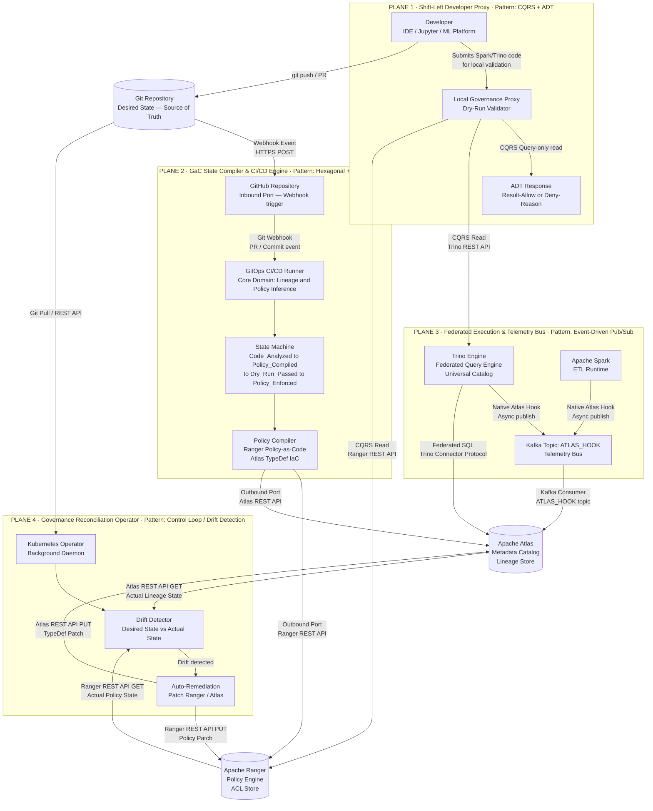

# Governance-as-Code: Macro Architecture (High-Level Topology)

**Classification:** Principal Architecture Document  
**Domain:** Enterprise Data Platform — Governance-as-Code (GaC)  
**Version:** 1.0.0  
**Diagrams:** 1 of 2

---

## Scope

This document defines the **High-Level Topology** of the Governance-as-Code system. The architecture implements a deterministic, declarative governance paradigm over Apache Atlas and Apache Ranger, with Trino acting as the Universal Catalog (Federated Query Engine) and Apache Spark as the ETL execution runtime. The system is decomposed into **4 orthogonal, fully decoupled planes**. Each plane carries explicit software design pattern annotations.

---

## Design Principles

| Principle | Implementation |
|---|---|
| Determinism | All governance state changes are driven by versioned Git commits (GitOps) |
| Decoupling | 4 planes communicate only through well-defined protocols (REST, Kafka, Webhook) |
| Shift-Left | Governance constraints evaluated at developer workstation before any commit |
| Drift Detection | Reconciliation Operator continuously enforces desired state against actual state |
| Zero Blocking | Runtime telemetry is emitted asynchronously via Kafka; Atlas consumes independently |

---

## Diagram: High-Level Topology

---

## Plane Summary

### Plane 1 — Shift-Left Developer Proxy
- **Pattern:** CQRS (Query-only side) + Algebraic Data Types (ADTs)
- Provides deterministic dry-run responses of the form `Result<Allow, Deny<Reason>>` before any code reaches CI/CD.
- Reads Trino catalog and Ranger policies as the **Single Source of Truth**. No writes occur from this plane.

### Plane 2 — GaC State Compiler & CI/CD Engine
- **Pattern:** Hexagonal Architecture + Explicit State Machine
- GitHub acts as the **Inbound Port**. Ranger/Atlas REST APIs act as **Outbound Ports**.
- Core domain (lineage/policy inference) is fully isolated from infrastructure concerns.
- State machine enforces a deterministic PR lifecycle: `Code_Analyzed → Policy_Compiled → Dry_Run_Passed → Policy_Enforced`.

### Plane 3 — Federated Execution & Telemetry Bus
- **Pattern:** Event-Driven Architecture (Pub/Sub)
- Native Trino/Spark Atlas hooks publish lineage events to `ATLAS_HOOK` Kafka topic **asynchronously**, eliminating compute blocking.
- Atlas consumes at its own pace — decoupled ingestion.

### Plane 4 — Governance Reconciliation Operator
- **Pattern:** Control Loop / Declarative State Matching (Drift Detection)
- Continuously compares **Desired State** (Git) with **Actual State** (Ranger + Atlas).
- On drift detection, auto-remediates by patching Ranger ACLs and Atlas TypeDefs.

---

*See `architecture-micro-v1.md` for the sequence-level execution and pattern flow diagram.*
