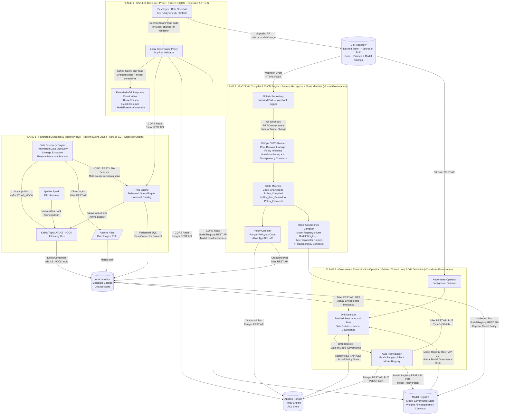

# Governance-as-Code: Macro Architecture (High-Level Topology)

**Classification:** Principal Architecture Document  
**Domain:** Enterprise Data Platform — Governance-as-Code (GaC) + AI Governance  
**Version:** 2.0.0  
**Diagrams:** 1 of 2  
**Supersedes:** `architecture-macro-v1.md` (v1.0.0)

---

## Revision Summary (v1 → v2)

| # | Revision | Scope |
|---|---|---|
| R1 | Added **Discovery Engine-based Automated Data Discovery & Lineage Extraction** engine as an autonomous sub-component in Plane 3, feeding both Kafka and Atlas directly | Plane 3 |
| R2 | Extended Plane 2 Core Domain to include **Model Registry-driven Model Governance** — model weights and hyperparameters now flow through CI/CD into Model Governance policies | Plane 2 |
| R3 | Extended Plane 4 Reconciliation scope to detect and remediate drift in **Model Governance policies** alongside Ranger ACLs and Atlas TypeDefs | Plane 4 |
| R4 | Extended ADT in Plane 1 from `Result<Allow, Deny<Reason>>` to `Result<Allow, Deny<Reason> | Mask<Columns> | ModelRestrict<Constraint>>` for Private AI / Agentic AI alignment | Plane 1 |

---

## Design Principles

| Principle | Implementation |
|---|---|
| Determinism | All governance state changes are driven by versioned Git commits (GitOps) |
| Decoupling | 4 planes communicate only through well-defined protocols (REST, Kafka, Webhook) |
| Shift-Left | Governance constraints — including model security — evaluated at developer workstation before any commit |
| Drift Detection | Reconciliation Operator enforces desired state across data policies, metadata, and model governance |
| Zero Blocking | Runtime telemetry (hook-based and Discovery Engine-based) is emitted asynchronously; Atlas consumes independently |
| AI Governance | Model lifecycle (weights, hyperparameters, transparency contracts) is a first-class governance citizen |

---

## Diagram: High-Level Topology (v2)



---

## Plane Summary (v2)

### Plane 1 — Shift-Left Developer Proxy
- **Pattern:** CQRS (Query-only side) + Extended Algebraic Data Types (ADTs)
- **v2 Change (R4):** ADT response extended from `Result<Allow, Deny<Reason>>` to a 4-variant sum type:
  ```
  Result<Allow | Deny<Reason> | Mask<Columns> | ModelRestrict<Constraint>>
  ```
  - `Mask<Columns>`: Returned when the principal may access the resource but with column-level masking applied (PII/Private AI scenarios).
  - `ModelRestrict<Constraint>`: Returned when a model change violates AI transparency contracts or Agentic AI security boundaries.
- Reads Trino catalog, Ranger policies, **and model registry governance** as the Single Source of Truth. No writes occur from this plane.

### Plane 2 — GaC State Compiler & CI/CD Engine
- **Pattern:** Hexagonal Architecture + Explicit State Machine
- **v2 Change (R2):** Core Domain now encompasses **Model Monitoring and AI Transparency Contract inference** in addition to lineage and data policy inference.
- Two Outbound Port classes:
  1. **PolicyCompiler** → Ranger (ACL) + Atlas (TypeDefs) — unchanged from v1
  2. **ModelGovernanceCompiler (Model Registry-driven)** → Model Registry — registers model weight policies, hyperparameter constraints, and AI transparency sidecar contracts
- State machine lifecycle is unchanged; both compilers are invoked in `Policy_Compiled` state and must both succeed before `Policy_Enforced`.

### Plane 3 — Federated Execution & Telemetry Bus
- **Pattern:** Event-Driven Architecture (Pub/Sub)
- **v2 Change (R1):** Added **Discovery Engine-based Automated Data Discovery & Lineage Extraction** engine as an autonomous sub-component with two emission paths:
  1. **Kafka path:** Publishes discovered lineage events to `ATLAS_HOOK` topic (same async Pub/Sub channel as native hooks)
  2. **Direct Atlas path:** For high-priority or batch discovery jobs, DiscoveryEngine can ingest directly via Atlas REST API, bypassing Kafka
- DiscoveryEngine scans external metadata sources (JDBC, REST, file-based) independently of Spark/Trino runtime execution, providing coverage for systems that have no native Atlas hook.

### Plane 4 — Governance Reconciliation Operator
- **Pattern:** Control Loop / Declarative State Matching (Drift Detection)
- **v2 Change (R3):** Drift detection scope expanded to three governance dimensions:
  1. **Ranger ACL drift** (data access policy)
  2. **Atlas TypeDef/lineage drift** (metadata governance)
  3. **Model Registry Governance drift** (AI model policy — weights, hyperparameters, transparency contracts)
- Auto-remediation now issues patches to Ranger, Atlas, **and Model Registry** REST APIs on detection.

---

*See `architecture-micro-v2.md` for the sequence-level execution and pattern flow diagram (v2).*
