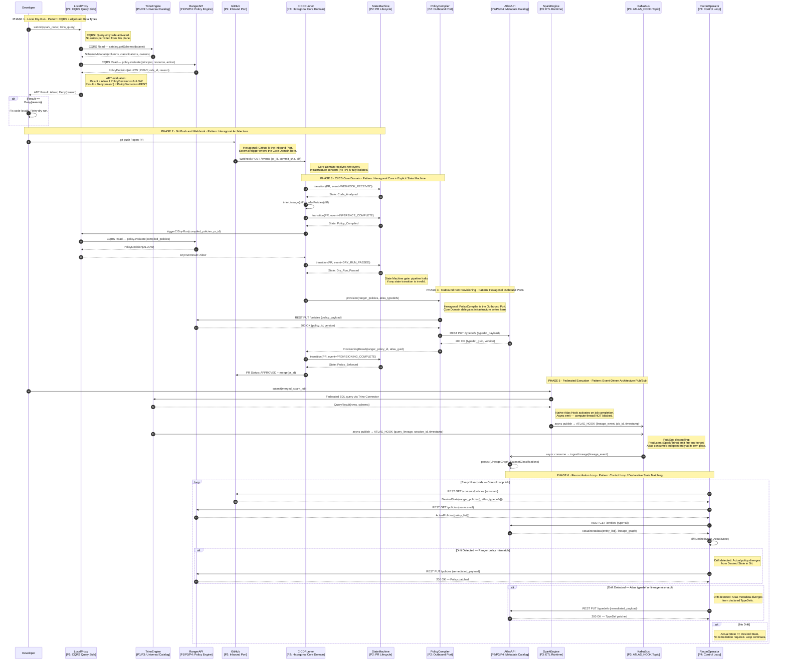

# Governance-as-Code: Micro Architecture (Low-Level Interaction Flow)

**Classification:** Principal Architecture Document  
**Domain:** Enterprise Data Platform — Governance-as-Code (GaC)  
**Version:** 1.0.0  
**Diagrams:** 2 of 2

---

## Scope

This document defines the **Low-Level Interaction Flow** for the complete lifecycle of a developer change to a Spark/Trino pipeline under the GaC system. The sequence diagram maps every actor-to-actor message, annotates each step with its governing software design pattern, and includes the asynchronous Kafka telemetry path and the Reconciliation Operator's eventual-consistency verification loop.

---

## Actors

| Actor | Plane | Role |
|---|---|---|
| `Developer` | P1 | Data Scientist / Engineer (IDE, Jupyter, ML Platform) |
| `LocalProxy` | P1 | Governance dry-run proxy — CQRS Query side |
| `TrinoEngine` | P1 / P3 | Universal Catalog + Federated Query Engine |
| `RangerAPI` | P1 / P2 / P4 | Apache Ranger REST endpoint |
| `GitHub` | P2 | Git repository — Inbound Port (Hexagonal) |
| `CICDRunner` | P2 | GitOps runner — Hexagonal Core Domain |
| `StateMachine` | P2 | PR lifecycle enforcer |
| `PolicyCompiler` | P2 | Outbound Port — Ranger/Atlas provisioner |
| `AtlasAPI` | P2 / P3 / P4 | Apache Atlas REST endpoint |
| `SparkEngine` | P3 | ETL Runtime with native Atlas hook |
| `KafkaBus` | P3 | `ATLAS_HOOK` topic — async telemetry bus |
| `ReconOperator` | P4 | Kubernetes Operator — Control Loop |

---

## Diagram: Low-Level Execution and Pattern Flow



---

## Pattern Reference by Phase

| Phase | Pattern | Structural Role |
|---|---|---|
| 1 — Local Dry-Run | **CQRS (Query side)** | Separates read path from write path. LocalProxy issues queries only; never mutates state. |
| 1 — Local Dry-Run | **Algebraic Data Types (ADTs)** | `Result<Allow, Deny<Reason>>` is a sum type. Response is total, exhaustive, and unambiguous. |
| 2 — Git Push | **Hexagonal Architecture (Inbound Port)** | GitHub Webhook is the external driver. The Core Domain is agnostic to the transport mechanism. |
| 3 — CI/CD Core | **Explicit State Machine** | PR lifecycle is a finite automaton. Invalid transitions are rejected, preventing out-of-order execution. |
| 4 — Provisioning | **Hexagonal Architecture (Outbound Port)** | PolicyCompiler adapts Core Domain output to Ranger/Atlas REST APIs. The Core Domain never speaks HTTP directly. |
| 5 — Execution | **Event-Driven Architecture (Pub/Sub)** | Fire-and-forget telemetry via Kafka. Producers and Atlas consumer are temporally and spatially decoupled. |
| 6 — Reconciliation | **Control Loop / Declarative State Matching** | Operator continuously reconciles Git-declared desired state against runtime actual state. Drift triggers auto-remediation. |

---

## State Machine Transitions (Plane 2)

```
[Code_Analyzed] ──INFERENCE_COMPLETE──► [Policy_Compiled]
[Policy_Compiled] ──DRY_RUN_PASSED──► [Dry_Run_Passed]
[Dry_Run_Passed] ──PROVISIONING_COMPLETE──► [Policy_Enforced]

Any invalid event in any state → REJECTED (pipeline blocked, PR not merged)
```

---

## Async Boundaries

Two explicit async boundaries exist in the system, both in Plane 3:

1. **Spark/Trino → Kafka (`ATLAS_HOOK`):** Fire-and-forget. Native hooks run on a separate thread pool. Query/job execution is never blocked waiting for telemetry acknowledgement.
2. **Kafka → Atlas:** Atlas consumes the `ATLAS_HOOK` topic independently. Backpressure and consumer lag are Atlas-internal concerns; producers are unaffected.

---

*See `architecture-macro-v1.md` for the macro-level plane topology and protocol annotations.*
