# Governance-as-Code: Micro Architecture (Low-Level Interaction Flow)

**Classification:** Principal Architecture Document  
**Domain:** Enterprise Data Platform — Governance-as-Code (GaC) + AI Governance  
**Version:** 2.0.0  
**Diagrams:** 2 of 2  
**Supersedes:** `architecture-micro-v1.md` (v1.0.0)

---

## Revision Summary (v1 → v2)

| # | Revision | Affected Phases |
|---|---|---|
| R1 | Added **Data Discovery Engine** as an autonomous async actor — emits to Kafka and directly to Atlas independent of Spark/Trino runtime hooks | Phase 5 |
| R2 | Extended CI/CD Core Domain to infer **Model Governance policies** from model change diffs; added `ModelGovernanceCompiler` (Model Registry-driven) as a second Outbound Port | Phase 3, Phase 4 |
| R3 | Extended Reconciliation Loop to fetch and diff **Model Registry Governance actual state** against Git desired state; auto-remediates model policy drift | Phase 6 |
| R4 | Extended ADT in LocalProxy from `Result<Allow, Deny<Reason>>` to `Result<Allow, Deny<Reason> | Mask<Columns> | ModelRestrict<Constraint>>` | Phase 1 |

---

## Actors (v2)

| Actor | Plane | Role |
|---|---|---|
| `Developer` | P1 | Data Scientist / Engineer (IDE, Jupyter, ML Platform) — submits code **and model changes** |
| `LocalProxy` | P1 | Governance dry-run proxy — CQRS Query side; evaluates data and model constraints |
| `TrinoEngine` | P1 / P3 | Universal Catalog + Federated Query Engine |
| `RangerAPI` | P1 / P2 / P4 | Apache Ranger REST endpoint |
| `ModelRegistryAPI` | P1 / P2 / P4 | Model Registry REST endpoint — Model Governance |
| `GitHub` | P2 | Git repository — Inbound Port (Hexagonal) |
| `CICDRunner` | P2 | GitOps runner — Hexagonal Core Domain (data + model governance) |
| `StateMachine` | P2 | PR lifecycle enforcer |
| `PolicyCompiler` | P2 | Outbound Port — Ranger/Atlas provisioner |
| `ModelGovCompiler` | P2 | Outbound Port — Model Registry Governance provisioner (NEW in v2) |
| `AtlasAPI` | P2 / P3 / P4 | Apache Atlas REST endpoint |
| `SparkEngine` | P3 | ETL Runtime with native Atlas hook |
| `KafkaBus` | P3 | `ATLAS_HOOK` topic — async telemetry bus |
| `DiscoveryEngine` | P3 | Discovery Engine-based Automated Data Discovery and Lineage Extraction (NEW in v2) |
| `ReconOperator` | P4 | Kubernetes Operator — Control Loop (expanded to Model Governance drift) |

---

## Diagram: Low-Level Execution and Pattern Flow (v2)

```mermaid
sequenceDiagram
    autonumber

    participant DEV as Developer
    participant PROXY as LocalProxy<br/>[P1: CQRS Query Side]
    participant TRINO as TrinoEngine<br/>[P1/P3: Universal Catalog]
    participant RANGER as RangerAPI<br/>[P1/P2/P4: Policy Engine]
    participant MREG as ModelRegistryAPI<br/>[P1/P2/P4: Model Governance]
    participant GH as GitHub<br/>[P2: Inbound Port]
    participant CICD as CICDRunner<br/>[P2: Hexagonal Core Domain]
    participant SM as StateMachine<br/>[P2: PR Lifecycle]
    participant COMPILE as PolicyCompiler<br/>[P2: Outbound Port - Data]
    participant MGOV as ModelGovCompiler<br/>[P2: Outbound Port - Model]
    participant ATLAS as AtlasAPI<br/>[P2/P3/P4: Metadata Catalog]
    participant SPARK as SparkEngine<br/>[P3: ETL Runtime]
    participant KAFKA as KafkaBus<br/>[P3: ATLAS_HOOK Topic]
    participant DISCOVERY_ENGINE as DiscoveryEngine<br/>[P3: Discovery and Lineage]
    participant RECON as ReconOperator<br/>[P4: Control Loop]

    %% ================================================================
    %% PHASE 1: LOCAL DRY-RUN — Pattern: CQRS + Extended ADT (v2)
    %% R4: ADT extended with Mask and ModelRestrict variants
    %% ================================================================
    Note over DEV,PROXY: PHASE 1 · Local Dry-Run · Pattern: CQRS + Extended ADT (v2)

    DEV->>PROXY: submit(spark_code | trino_query | model_change_diff)
    Note right of PROXY: CQRS: Query-only side activated.<br/>Evaluates both data governance<br/>and model security constraints.

    PROXY->>TRINO: CQRS Read — catalog.getSchema(dataset)
    TRINO-->>PROXY: SchemaMetadata{columns, classifications, pii_flags}

    PROXY->>RANGER: CQRS Read — policy.evaluate(principal, resource, action)
    RANGER-->>PROXY: PolicyDecision{ALLOW | DENY, rule_id, mask_spec}

    PROXY->>MREG: CQRS Read — model.evaluateConstraints(model_id, change_diff)
    MREG-->>PROXY: ModelDecision{ALLOW | RESTRICT, constraint_id, transparency_contract}

    Note right of PROXY: Extended ADT evaluation (v2):<br/>Allow — full access granted<br/>Deny(reason) — access rejected<br/>Mask(columns) — access with PII masking<br/>ModelRestrict(constraint) — model change violates<br/>AI transparency or Agentic AI security boundary

    PROXY-->>DEV: ADT Result: Allow | Deny(reason) | Mask(columns) | ModelRestrict(constraint)

    alt Result == Deny(reason)
        DEV->>DEV: Fix code locally. Retry dry-run.
    end

    alt Result == Mask(columns)
        DEV->>DEV: Acknowledge masking policy. Adjust pipeline for masked schema.
    end

    alt Result == ModelRestrict(constraint)
        DEV->>DEV: Revise model change to comply with AI governance contract.
    end

    %% ================================================================
    %% PHASE 2: GIT PUSH & WEBHOOK — Pattern: Hexagonal (Inbound Port)
    %% Unchanged from v1 — extended payload includes model change diff
    %% ================================================================
    Note over DEV,SM: PHASE 2 · Git Push and Webhook · Pattern: Hexagonal Architecture

    DEV->>GH: git push / open PR (code change or model change)
    Note right of GH: Hexagonal: GitHub is the Inbound Port.<br/>Payload may contain Spark/Trino diffs<br/>or model weight / hyperparameter diffs.

    GH->>CICD: Webhook POST /events {pr_id, commit_sha, diff, change_type}
    Note right of CICD: Core Domain receives raw event.<br/>change_type: DATA_PIPELINE | MODEL_CHANGE | BOTH

    %% ================================================================
    %% PHASE 3: CI/CD CORE DOMAIN — Pattern: Hexagonal + State Machine
    %% R2: Core Domain now infers Model Governance policies in addition
    %%     to data lineage and Ranger policies
    %% ================================================================
    Note over CICD,MGOV: PHASE 3 · CI/CD Core Domain · Pattern: Hexagonal Core + State Machine (v2 + Model Governance)

    CICD->>SM: transition(PR, event=WEBHOOK_RECEIVED)
    SM-->>CICD: State: Code_Analyzed

    CICD->>CICD: inferLineage(diff) + inferDataPolicies(diff)
    CICD->>CICD: inferModelGovernance(diff) + inferAITransparencyContracts(diff)
    Note right of CICD: v2: Core Domain now also extracts<br/>model weight change semantics,<br/>hyperparameter delta, and<br/>AI transparency contract requirements.

    CICD->>SM: transition(PR, event=INFERENCE_COMPLETE)
    SM-->>CICD: State: Policy_Compiled

    CICD->>PROXY: triggerCI DryRun(compiled_data_policies, compiled_model_policies)
    PROXY->>RANGER: CQRS Read — policy.evaluate(compiled_data_policies)
    RANGER-->>PROXY: PolicyDecision{ALLOW}
    PROXY->>MREG: CQRS Read — model.evaluateConstraints(compiled_model_policies)
    MREG-->>PROXY: ModelDecision{ALLOW}
    PROXY-->>CICD: DryRunResult: Allow (data + model)

    CICD->>SM: transition(PR, event=DRY_RUN_PASSED)
    SM-->>CICD: State: Dry_Run_Passed

    Note right of SM: State Machine gate: pipeline halts<br/>if either data or model dry-run fails.<br/>Both must pass before advancing.

    %% ================================================================
    %% PHASE 4: OUTBOUND PORT PROVISIONING — Pattern: Hexagonal (Outbound Ports)
    %% R2: Two Outbound Port classes now provisioned in parallel
    %%     PolicyCompiler (data) + ModelGovCompiler (model/Model Registry)
    %% ================================================================
    Note over COMPILE,MGOV: PHASE 4 · Outbound Port Provisioning · Pattern: Hexagonal Outbound Ports (v2 - Dual Compiler)

    CICD->>COMPILE: provision(ranger_policies, atlas_typedefs)
    CICD->>MGOV: provision(model_governance_policies, ai_transparency_contracts)
    Note right of COMPILE: Hexagonal: Two independent Outbound Ports.<br/>PolicyCompiler handles data governance.<br/>ModelGovCompiler handles AI governance.

    COMPILE->>RANGER: REST PUT /policies {data_policy_payload}
    RANGER-->>COMPILE: 200 OK {policy_id, version}

    COMPILE->>ATLAS: REST PUT /typedefs {typedef_payload}
    ATLAS-->>COMPILE: 200 OK {typedef_guid, version}

    MGOV->>MREG: REST PUT /models/{model_id}/governance {policy_payload}
    MREG-->>MGOV: 200 OK {governance_id, transparency_contract_hash}

    MGOV->>MREG: REST PUT /models/{model_id}/transparency {contract_payload}
    MREG-->>MGOV: 200 OK {contract_id, version}

    COMPILE-->>CICD: DataProvisioningResult{ranger_policy_id, atlas_guid}
    MGOV-->>CICD: ModelProvisioningResult{governance_id, contract_id}

    CICD->>SM: transition(PR, event=PROVISIONING_COMPLETE)
    SM-->>CICD: State: Policy_Enforced

    CICD->>GH: PR Status: APPROVED + merge(pr_id)

    %% ================================================================
    %% PHASE 5: FEDERATED EXECUTION — Pattern: Event-Driven (Pub/Sub)
    %% R1: Added DiscoveryEngine Engine as autonomous discovery sub-component
    %%     Two emission paths: Kafka (async) and Atlas direct (batch)
    %% ================================================================
    Note over SPARK,DISCOVERY_ENGINE: PHASE 5 · Federated Execution + Discovery · Pattern: Event-Driven Pub/Sub (v2 + DiscoveryEngine)

    DEV->>SPARK: submit(merged_spark_job)
    SPARK->>TRINO: Federated SQL query via Trino Connector
    TRINO-->>SPARK: QueryResult{rows, schema}

    Note right of SPARK: Native Atlas Hook activates on job completion.<br/>Async emit — compute thread NOT blocked.

    SPARK-)KAFKA: async publish ATLAS_HOOK {lineage_event, job_id, timestamp}
    TRINO-)KAFKA: async publish ATLAS_HOOK {query_lineage, session_id, timestamp}

    Note right of DISCOVERY_ENGINE: DiscoveryEngine runs autonomously — independent<br/>of Spark/Trino job execution lifecycle.<br/>Scans external sources: JDBC, REST, file systems.<br/>Provides coverage for systems with no native hook.

    DISCOVERY_ENGINE->>TRINO: JDBC/REST scan — crawl(catalog, schema, table_list)
    TRINO-->>DISCOVERY_ENGINE: CatalogSnapshot{tables, columns, types, stats}

    DISCOVERY_ENGINE-)KAFKA: async publish ATLAS_HOOK {discovered_lineage, source_system, scan_id}

    DISCOVERY_ENGINE->>ATLAS: REST POST /entities {batch_lineage_payload, scan_id}
    Note right of DISCOVERY_ENGINE: Direct Atlas ingest path (batch mode).<br/>Used when discovery job produces high-volume<br/>metadata that bypasses Kafka for latency control.
    ATLAS-->>DISCOVERY_ENGINE: 200 OK {entity_guids[], created_count}

    Note right of KAFKA: Pub/Sub decoupling:<br/>All producers (Spark, Trino, DiscoveryEngine) emit fire-and-forget.<br/>Atlas consumes ATLAS_HOOK independently at its own pace.

    KAFKA-)ATLAS: async consume ATLAS_HOOK ingestLineage(lineage_event)
    ATLAS-->>ATLAS: persist(LineageGraph, DatasetClassifications, DiscoveredEntities)

    %% ================================================================
    %% PHASE 6: RECONCILIATION LOOP — Pattern: Control Loop / Drift Detection
    %% R3: Loop now checks Model Governance drift (Model Registry) in addition
    %%     to Ranger policy drift and Atlas metadata drift
    %% ================================================================
    Note over RECON,ATLAS: PHASE 6 · Reconciliation Loop · Pattern: Control Loop / Declarative State Matching (v2 + Model Governance)

    loop Every N seconds — Control Loop tick

        RECON->>GH: REST GET /contents {ref=main, path=policies/}
        GH-->>RECON: DesiredState{ranger_policies[], atlas_typedefs[], model_governance_policies[]}

        RECON->>RANGER: REST GET /policies {service=all}
        RANGER-->>RECON: ActualDataPolicies{policy_list[]}

        RECON->>ATLAS: REST GET /entities {type=all}
        ATLAS-->>RECON: ActualMetadata{entity_list[], lineage_graph, discovered_entities[]}

        RECON->>MREG: REST GET /models {include_governance=true}
        MREG-->>RECON: ActualModelGovernance{model_list[], governance_policies[], contract_hashes[]}

        RECON->>RECON: diff(DesiredState, ActualDataPolicies, ActualMetadata, ActualModelGovernance)
        Note right of RECON: Three-dimensional diff in v2:<br/>1. Ranger ACL policies<br/>2. Atlas TypeDefs and lineage<br/>3. model registry governance and AI transparency contracts

        alt Drift Detected — Ranger data policy mismatch
            Note right of RECON: Data policy drift: Actual Ranger ACL<br/>diverges from Git desired state.
            RECON->>RANGER: REST PUT /policies {remediated_data_payload}
            RANGER-->>RECON: 200 OK — Data policy patched
        end

        alt Drift Detected — Atlas typedef or lineage mismatch
            Note right of RECON: Metadata drift: Atlas TypeDef or lineage<br/>graph diverges from declared state.
            RECON->>ATLAS: REST PUT /typedefs {remediated_typedef_payload}
            ATLAS-->>RECON: 200 OK — TypeDef patched
        end

        alt Drift Detected — model registry governance mismatch
            Note right of RECON: Model governance drift: actual model policy<br/>or AI transparency contract hash differs<br/>from Git desired state. Auto-remediate.
            RECON->>MREG: REST PUT /models/{model_id}/governance {remediated_model_payload}
            MREG-->>RECON: 200 OK — Model governance policy patched
            RECON->>MREG: REST PUT /models/{model_id}/transparency {remediated_contract}
            MREG-->>RECON: 200 OK — AI transparency contract restored
        end

        alt No Drift — All Dimensions
            Note right of RECON: Actual State == Desired State<br/>across data, metadata, and model governance.<br/>No remediation required. Loop continues.
        end
    end
```



---

## Pattern Reference by Phase (v2)

| Phase | Pattern | Structural Role | v2 Delta |
|---|---|---|---|
| 1 — Local Dry-Run | **CQRS (Query side)** | Separates read path from write path. LocalProxy queries only; never mutates state. | Reads model registry constraints in addition to Trino/Ranger |
| 1 — Local Dry-Run | **Extended ADTs** | `Result<Allow, Deny<Reason>, Mask<Columns>, ModelRestrict<Constraint>>` — total, exhaustive, unambiguous | +2 new variants: `Mask` and `ModelRestrict` |
| 2 — Git Push | **Hexagonal Architecture (Inbound Port)** | GitHub Webhook is the external driver. Core Domain agnostic to transport. | Payload now carries `change_type` discriminator |
| 3 — CI/CD Core | **Explicit State Machine** | PR lifecycle finite automaton. Invalid transitions rejected. | Core Domain infers model governance policies alongside data policies |
| 4 — Provisioning | **Hexagonal Architecture (Outbound Ports)** | Two independent Outbound Ports: `PolicyCompiler` (data) and `ModelGovCompiler` (model). Core Domain never speaks HTTP directly. | Added `ModelGovCompiler` →  as second Outbound Port |
| 5 — Execution | **Event-Driven Architecture (Pub/Sub)** | Fire-and-forget telemetry via Kafka. Producers and Atlas consumer temporally decoupled. | DiscoveryEngine is a third producer with dual emission paths (Kafka + Atlas direct) |
| 6 — Reconciliation | **Control Loop / Declarative State Matching** | Operator reconciles Git desired state against runtime actual state. Drift triggers auto-remediation. | Three-dimensional drift detection: Ranger + Atlas + Model Registry |

---

## State Machine Transitions (Plane 2 — unchanged)

```
[Code_Analyzed] ──INFERENCE_COMPLETE──► [Policy_Compiled]
[Policy_Compiled] ──DRY_RUN_PASSED──► [Dry_Run_Passed]
[Dry_Run_Passed] ──PROVISIONING_COMPLETE──► [Policy_Enforced]

Any invalid event in any state → REJECTED (pipeline blocked, PR not merged)
Note: DRY_RUN_PASSED requires BOTH data governance and model governance dry-runs to pass.
Note: PROVISIONING_COMPLETE requires BOTH PolicyCompiler and ModelGovCompiler to succeed.
```

---

## Async Boundaries (v2)

Three explicit async boundaries exist in the system:

1. **Spark/Trino → Kafka (`ATLAS_HOOK`):** Fire-and-forget. Native hooks run on a separate thread pool. Query/job execution is never blocked waiting for telemetry acknowledgement.
2. **Kafka → Atlas:** Atlas consumes the `ATLAS_HOOK` topic independently. Backpressure and consumer lag are Atlas-internal concerns; producers are unaffected.
3. **DiscoveryEngine → Kafka (`ATLAS_HOOK`) [NEW in v2]:** DiscoveryEngine discovery jobs publish discovered lineage events asynchronously. The scanner lifecycle is fully decoupled from Spark/Trino execution. DiscoveryEngine also supports a **direct Atlas ingest path** (synchronous batch REST) for high-volume or high-priority discovery workloads.

---

## Extended ADT Specification (v2)

```
Result<Allow | Deny<Reason> | Mask<Columns> | ModelRestrict<Constraint>>

Variants:
  Allow
    → Principal is authorized. No restrictions.

  Deny<Reason>
    → Access rejected. Reason: rule_id, policy_name, violated_clause.

  Mask<Columns>
    → Access granted. Columns: [col_name, mask_type, pii_class].
    → Pipeline must operate on masked schema. Applicable for Private AI scenarios.

  ModelRestrict<Constraint>
    → Model change violates governance boundary.
    → Constraint: {constraint_id, violated_contract, ai_transparency_clause, agentic_ai_risk_class}.
    → Developer must revise model diff to comply before re-submission.
```

---

*See `architecture-macro-v2.md` for the macro-level plane topology and protocol annotations (v2).*
